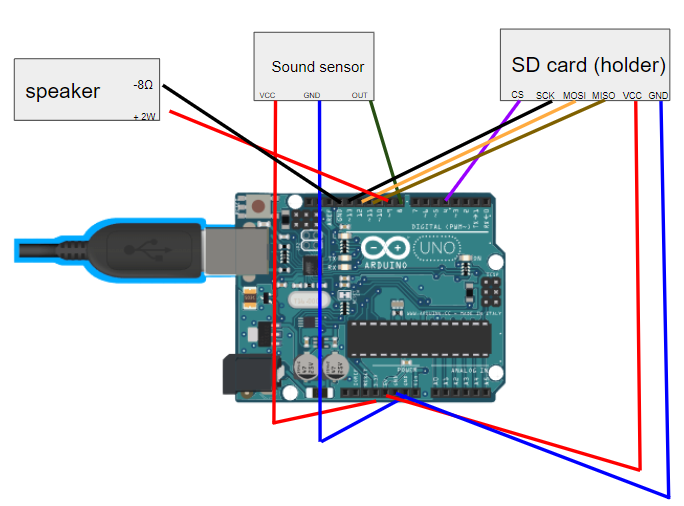

# WALL-Y - your dog's bff
"WALL-Y," which (the name) is inspired by Disney's "WALL-E" and my nick name "Wally," is a robot that moniters and takes care of my dog. It plays a calming sound whenever he barks, and then feeds him treats.

| **Engineer** | **School** | **Area of Interest** | **Grade** |
|:--:|:--:|:--:|:--:|
| Wallace R | Alameda Science & Technology Institue | General Engineering | Incoming Junior

**Replace the BlueStamp logo below with an image of yourself and your completed project. Follow the guide [here](https://tomcam.github.io/least-github-pages/adding-images-github-pages-site.html) if you need help.**


  
# Final Milestone
here

<iframe width="560" height="315" src="https://www.youtube.com/embed/lFGRuzOZDkc" title="YouTube video player" frameborder="0" allow="accelerometer; autoplay; clipboard-write; encrypted-media; gyroscope; picture-in-picture; web-share" allowfullscreen></iframe>

# Second Milestone
My first modification that I created was a treat pusher. Out of popsicle sticks, I created a big platform that was attached to the back of the rover. On the top of the platform, I placed treats for my dog and covered it with a cup barely floating over the platform. The rover that I previously created will autonomously back up. Then the treats that are placed on the platform will be pushed into the slope by the cup and into my dog’s “treat spot.” The rover will go forward to its original spot, and the cycle will continue again. 

Next, the three biggest challenges I faced were finding the perfect height for the cup, catering the design to the amount of space I had, and making the machine out of popsicle sticks. Firstly, finding the perfect height for the cup was difficult because I had to make the cup low enough to hit the treats, but also high enough so that the friction wouldn’t cause the platform and cup to stick. I eventually overcame this challenge by doing lots of tests. Next, I had little space to work with because I had to put the robot above my dog’s “treat spot.” I tried moving the treat spot somewhere else, but whenever I called him for treats, he automatically went to that spot no matter what. It was difficult at first to come up with a design, however after thinking about the minimal design of a coin pusher, I decided to base the modification off of it. Lastly, building it out of popsicle sticks was difficult because one, I had to make it tall enough so that the slope of the ramp was big enough for the treats to slide off, and two because I had to make it sturdy enough for it to withstand the force of the robot. I kept in mind to balance the forces which is why there are lots of triangular designs. (Any weight placed on a triangle is evenly distributed to each side). 

This milestone is a big stepping stone for my final goal, which is to have a microphone sensor detect dog barks, and then have a speaker play a soothing sound which will then say “treats” right afterward to calm it down. This will send me a notification and the treat pusher will be activated.

<iframe width="560" height="315" src="https://www.youtube.com/embed/tXyQ7q111XY" title="YouTube video player" frameborder="0" allow="accelerometer; autoplay; clipboard-write; encrypted-media; gyroscope; picture-in-picture; web-share" allowfullscreen></iframe>

# First Milestone
My project is the table top robot. Why the table top robot? Well after the modifications that I will undergo, the table top robot will be a robot that has the ability to monitor and take care of my dog (who recently had surgery twice). The table top robot stood out to me because it has edge and obstacle detecting ability, meaning my dog will not be able to roll it off a table/get it stuck. 

Moving on, the main pieces of the table top robot are the motors, an ultrasonic sensor, and an arduino. First, motors convert electrical energy into mechanical energy. The motor generates a magnetic field that complements the conductors that carry currents. The interaction allows linear/rotational motion. Next, ultrasonic sensors can find the distance between the sensor and an object. It emits ultrasonic waves and measures the time it takes for the ultrasonic waves to bounce back after hitting an object. In my case, the module allows my robot to avoid obstacles and edges. Lastly, an arduino is a microcontroller. It is programmable and it allowed me to write and upload code. 

In this milestone, I’ve finished assembling and coding the table top robot base kit. The hardest part of assembling the robot was using the nut and screw because of the extremely small size. Subsequently, although most of the coding was straightforward, making the robot go slower took a decent amount of time. This is because I didn’t know the exact speed that I wanted it to go, which meant I had to guess and check until the robot went the speed that I desired. 

My next goal I have is to add modifications to the base kit that will pamper my dog. I plan on making a treat dispenser that will dispense out treats to him whenever he needs it. 

<iframe width="560" height="315" src="https://www.youtube.com/embed/lFGRuzOZDkc" title="YouTube video player" frameborder="0" allow="accelerometer; autoplay; clipboard-write; encrypted-media; gyroscope; picture-in-picture; web-share" allowfullscreen></iframe>

# Schematics


# Code (for the dog bark detection)
Here's where you'll put your code. The syntax below places it into a block of code. Follow the guide [here]([url](https://www.markdownguide.org/extended-syntax/)) to learn how to customize it to your project needs. 

```c++
// too long to put here, but you need to #define all the notes. e.g. #define NOTE_B0 31
#include <SD.h>
#include <SPI.h>
#include <TMRpcm.h>

TMRpcm tmrpcm; 

// Sound sensor pin
const int soundSensorPin = 9;

// Threshold value for sound level
const int threshold = 90;

// notes
int melody[] = {
  NOTE_D4, NOTE_G4, NOTE_FS4, NOTE_A4,
  NOTE_G4, NOTE_C5, NOTE_AS4, NOTE_A4,
  END
};

// note durations: 8 = quarter note, 4 = 8th note, etc.
int noteDurations[] = {       //duration of the notes
  8, 4, 8, 4,
  4, 4, 4, 12
};

int speed = 90;  // higher value, slower notes

void setup() {
  Serial.begin(9600);
  tmrpcm.speakerPin = 4;  // 
  SD.begin(4);  // 
}

void loop() {
  // Read the sound level from the sensor
  int soundLevel = analogRead(soundSensorPin);

  // Check if the sound level is greater than or equal to the threshold
  if (soundLevel >= threshold) {
    for (int thisNote = 0; melody[thisNote] != -1; thisNote++) {
      int noteDuration = speed * noteDurations[thisNote];
      tone(3, melody[thisNote], noteDuration * 0.95);
      Serial.println(melody[thisNote]);
      delay(noteDuration);
      noTone(3);
    }

    // Play the WAV file from the SD card
    tmrpcm.play("perfect.wav"); 
    while (tmrpcm.isPlaying()) {
      // Wait for WAV file to finish playing
    }
  }
}

```

# Bill of Materials
Here's where you'll list the parts in your project. To add more rows, just copy and paste the example rows below.
Don't forget to place the link of where to buy each component inside the quotation marks in the corresponding row after href =. Follow the guide [here]([url](https://www.markdownguide.org/extended-syntax/)) to learn how to customize this to your project needs. 

| **Part** | **Note** | **Price** | **Link** |
|:--:|:--:|:--:|:--:|
| Item Name | What the item is used for | $Price | Link |
|ELEGOO Smart Robot|Base Kit|80$| <a href="https://www.amazon.com/ELEGOO-Tracking-Ultrasonic-Intelligent-Educational/dp/B07KPZ8RSZ/ref=sr_1_6?crid=3ITT6Z3NJ6QQ6&keywords=elegoo+kit&qid=1684951773&sprefix=elegoo+ki%2Caps%2C164&sr=8-6"> Link </a> |
| Arduino | Extra for Sensors | 17$ | <a href="https://www.amazon.com/Arduino-A000066-ARDUINO-UNO-R3/dp/B008GRTSV6/"> Link </a> |
| SD Card reader module | Read/write files | 6.5$ | <a href="https://www.amazon.com/Maxmoral-Storage-Expansion-Interface-Adapter/dp/B07S3F4BLN/ref=sr_1_2?crid=1IWTVZPIHUDI2&keywords=Modulo+Micro+SD+card+mini+TF+card+reader+modulo+SPI+%28Arduino+Compatibile%29&qid=1686860460&sprefix=modulo+micro+sd+card+mini+tf+card+reader+modulo+spi+arduino+compatibile+%2Caps%2C172&sr=8-2"> Link </a> |
| Sound Sensor Mic | Detects barks | 6$ | <a href="https://www.amazon.com/DAOKI-Sensitivity-Microphone-Detection-Arduino/dp/B00XT0PH10/ref=sr_1_1?crid=3FFUV27XYCKVH&keywords=arduino+sound+sensor&qid=1686860529&sprefix=arduino+sound+senso%2Caps%2C159&sr=8-1"> Link </a> |
| SanDisk Card | Records data | 9$ | <a href="https://www.amazon.com/Arduino-A000066-ARDUINO-UNO-R3/dp/B008GRTSV6/](https://www.amazon.com/SanDisk-Ultra-microSDHC-Memory-Adapter/dp/B08GYBBBBH/ref=sr_1_2?crid=1JDK0WFWN9DDK&keywords=micro+sd&qid=1686860591&sprefix=micro+sd%2Caps%2C164&sr=8-2"> Link </a> |
| Card Reader | Reads data for computer | 14$ | <a href="https://www.amazon.com/SmartQ-C368-Multi-Card-Compatible-Supports/dp/B06Y1G18KS/ref=sr_1_3?crid=2H0RQ24IH63YE&keywords=mini+sd+card+adapter&qid=1686860651&sprefix=mini+sd+card+adapte%2Caps%2C171&sr=8-3"> Link </a> |
| Breadboard | Builds temporary circuits | 6.5$ | <a href="https://a.co/d/0SOJmGt"> Link </a> |
| Extra micro servo | Produces torque and velocity | 9$ | <a href="https://www.amazon.com/Micro-Servos-Helicopter-Airplane-Controls/dp/B07MLR1498/ref=sr_1_7?crid=M3UTWSUM0J38&keywords=servo&qid=1687208050&sprefix=serv%2Caps%2C135&sr=8-7"> Link </a> |
| Magnetic speaker | Plays wav files | 9$ | <a href="https://www.amazon.com/gp/product/B0177ABRQ6/ref=ppx_yo_dt_b_asin_image_o00_s00?ie=UTF8&psc=1"> Link </a> |
| Connector | Battery for the bark detector | 7$ | <a href="https://www.amazon.com/Battery-ZRM-Plastic-I-Type-Connector/dp/B0B689YYM5/ref=sr_1_25?crid=2WPTHBLPA331V&keywords=9v+with+male&qid=1687582073&sprefix=9v+with+male%2Caps%2C136&sr=8-25"> Link </a> |

# Other Resources/Examples
One of the best parts about Github is that you can view how other people set up their own work. Here are some past BSE portfolios that are awesome examples. You can view how they set up their portfolio, and you can view their index.md files to understand how they implemented different portfolio components.
- [Example 1](https://trashytuber.github.io/YimingJiaBlueStamp/)
- [Example 2](https://sviatil0.github.io/Sviatoslav_BSE/)
- [Example 3](https://arneshkumar.github.io/arneshbluestamp/)

To watch the BSE tutorial on how to create a portfolio, click here.
